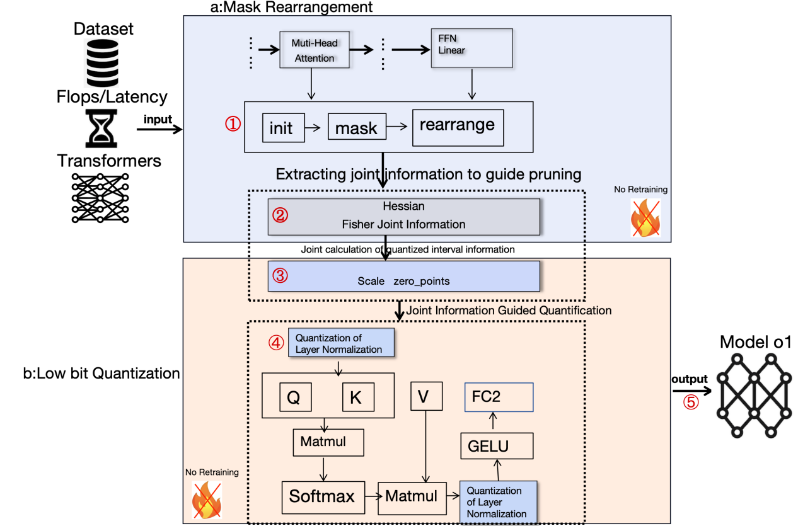

# FHPG: A Unified Framework for Transformer with Pruning and Quantization [Pattern Recognition Letters, 2026 ]

This repository contains PyTorch implementations for FHPG.
For details see [FHPG: A Unified Framework for Transformer with Pruning and Quantization](https://www.sciencedirect.com/science/article/abs/pii/S0167865526000280)

FHPG is a lightweight framework for vision models that leverages structured pruning and low-bit quantization to reduce model complexity, significantly accelerating inference while maintaining accuracy loss below 1%.




## Setup
Step 1: Create a new conda environment:
```
conda create -n fhpg python=3.8
conda activate fhpg
```
Step 2: Install relevant packages
```
cd /path to deit_fhpg 
pip install -r requirements.txt
```

## Data preparation

Download and extract ImageNet train and val images from http://image-net.org/.
The directory structure is the standard layout for the torchvision [`datasets.ImageFolder`](https://pytorch.org/docs/stable/torchvision/datasets.html#imagefolder), and the training and validation data is expected to be in the `train/` folder and `val` folder respectively:

```
/path to imagenet
  train/
    class1/
      img1.jpeg
    class2/
      img2.jpeg
  val/
    class1/
      img3.jpeg
    class/2
      img4.jpeg
```

## pruned and quantized
The scripts folder contrains all the bash commands to replicate the main results in our paper:

Executing the command below will generate a DeiT-Base model that has been both pruned and quantized. The pruning masks, obtained from Fisher-Hessian analysis, are used to guide pruning and then processed to determine appropriate quantization intervals. A pruning ratio of 40% is applied, producing results in agreement with Table 1.

<details>

<summary>
Prune deit-base 50% FLOPs
</summary>

```
python main.py \
    --finetune=/path to deit_base checkpoint \
    --batch-size=32 \
    --num_workers=16 \
    --data-path=/path to ImageNet \
    --model=deit_base_patch16_224 \
    --pruning_per_iteration=100 \
    --pruning_feed_percent=0.1 \
    --pruning_method=2 \
    --pruning_layers=3 \
    --pruning_flops_percentage=0.50 \
    --pruning_flops_threshold=0.0001 \
    --need_hessian  \
    --finetune_op=2 \
    --epochs=1 \
    --output_dir=/path to output
```

</details>

You can change FLOPs reduction or model as you wish.
If you have already get pruned and quantized importance metric, you can simply load them by setting:
```python
--pruning_pickle_from=/path to importance
```
For help information of the arguments please see main.py.
## Fine-tune
After pruning and quantizing DeiT-Base, it is necessary to fine-tune the model to restore its performance. Execute the following command to perform fine-tuning on ImageNet using a single node with 4 GPUs, a total batch size of 1024, for 100 epochs.

<details>

<summary>
Fine-tune pruned DeiT-base
</summary>

```
GPU_NUM=4
output_dir=/path to output
ck_dir=$output_dir/checkpoint.pth
# check if checkpoint exists
if [ -e $ck_dir ];then
   CMD="--resume=${ck_dir}"
else
   CMD="--resume="
fi
python -m torch.distributed.launch --nproc_per_node=${GPU_NUM}  --use_env  main_deploy.py \
    --dist-eval \
    $CMD \
    --masked_model=/path to pruned_model in previous step prune \
    --teacher-path=/path to regnet model as deit paper\
    --batch-size=128\
    --num_workers=16 \
    --data-path=/path to ImageNet \
    --model=deit_base_patch16_224_deploy \
    --pruning_flops_percentage=0 \
    --finetune_op=1 \
    --epochs=100 \
    --warmup-epochs=0 \
    --cooldown-epochs=0 \
    --output_dir=$output_dir
```

</details>

**Note:** Fine-tuning is performed after pruning and quantization to obtain a more compact model. The pruned model must be properly processed before quantization, with the specific procedure depending on the model architecture. How the model is processed directly affects the final quantization and overall inference performance.

To facilitate reproduction of our results, we provide the logs folder
 for pruning and fine-tuning. Minor discrepancies between the results in the logs and those reported in the paper may arise due to the PyTorch version. Careful tuning of the learning rate and other training parameters is essential, as inappropriate settings can affect inference outcomes and the final model accuracy.
# Acknowledgement
Our repository is built on the [Deit](https://github.com/facebookresearch/deit/blob/main/README_deit.md), [Taylor_pruning](https://github.com/NVlabs/Taylor_pruning), [SAViT](https://github.com/hikvision-research/SAViT/tree/main), [Timm](https://github.com/huggingface/pytorch-image-models) and [flops-counter](https://github.com/sovrasov/flops-counter.pytorch), we sincerely thank the authors for their nicely organized code!
# License
This repository is released under the Apache 2.0 license as found in the [LICENSE](LICENSE) file.
# Citation
If you find this repository helpful, please cite:

```
@article{ren2026fhpg,
  title={FHPG: A Unified Framework for Transformer with Pruning and Quantization},
  author={Ren, Ruiguo},
  journal={Pattern Recognition Letters},
  year={2026},
  publisher={Elsevier}
}
```
